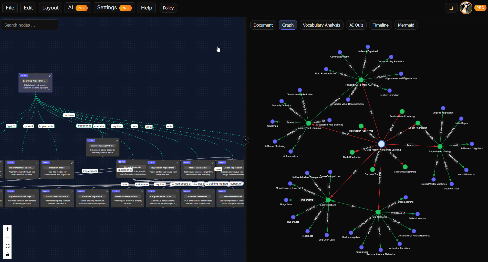

# DraftPlan Example Repository

This repository is a minimal example you can use with [DraftPlan](https://draftplan.work) to organize, author, and iterate on topic-based learning plans or project documentation.

It includes a sample `.learning` file that you can open in DraftPlan and a `docs/` folder to keep supporting notes and artifacts.

## Contents

- `examples/` — example DraftPlan project assets
  - `Learning-Algorithm-Machine-Learning.learning` — a sample learning plan file you can import into DraftPlan
- `docs/` — place for Markdown notes, references, and supporting materials
- `Readme.md` — this guide

## Quickstart

1. Open DraftPlan in your browser: https://draftplan.work
2. (Optional) Sign in (top-right) to save your work in the cloud.
3. Import the example plan:
	- Use the `File` menu → `Open`and select `examples/Learning-Algorithm-Machine-Learning.learning` from this repo.
4. Explore the graph on the left; edit notes on the right. You can write in Markdown, attach references, and structure topics hierarchically.
5. Use built-in tools as needed:
	- AI assist ("AI generate") to draft sections (review outputs for accuracy).
	- Mermaid diagrams for visual models.
	- Quiz/Timeline views to test understanding or sequence milestones.
6. Save or export your changes:
	- From `File`, choose save/export to download the updated `.learning` file and commit it back to your repo.

## Customize

- Duplicate the example `.learning` file and rename it for your project.
- Add supporting materials in `docs/` (diagrams, notes, references).
- Keep larger datasets or assets out of version control, or store links instead.

## Suggested Workflow

- Author in DraftPlan, keeping the source-of-truth `.learning` file in `examples/`.
- Track decisions and research in `docs/` using Markdown.
- Commit changes regularly; include snapshots exported from DraftPlan when you reach milestones.

## Contributing

Issues and pull requests are welcome. If you add new example plans, place them under `examples/` and update this README with a short description of the addition.

## Notes

- The `.learning` file in `examples/` is a binary project file intended for DraftPlan. Edit it via the web app, not directly.
- DraftPlan is continuously evolving; UI labels may vary slightly. If you encounter import/export issues, try using drag-and-drop onto the editor area.

